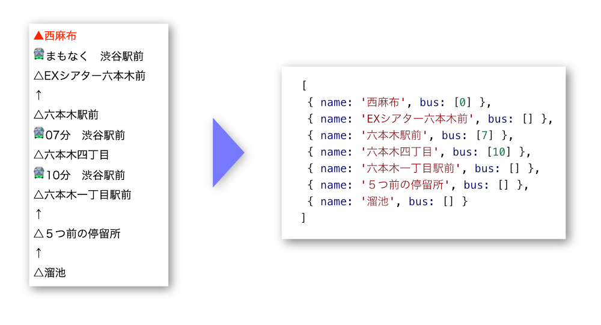

# Node.js 用都バス接近情報解析モジュール

フィーチャーフォン（ガラケー）向けの[都バス車両接近情報のページ](https://tobus.jp/blsys/navim)をスクレイピングして、バス接近情報を取得します。

ガラケー向けのページを使っているのは、軽量（スマホ向けの 1/10 程度）かつ解析が楽だからです。

次のように接近情報を取得できます。



## 使い方

### バス停 ID を指定する方法

次のようにバス停 ID（`busStopId`）、のりば ID（`poleId`）、路線 ID（`routeId`）を指定します。

```js
const tobus = require('tobus');

tobus
  .approaching({
    busStopId: 1130,
    poleId: 3,
    routeId: 6
  })
  .then(a => {
    console.log(a);
  });

// [ { name: '西麻布', bus: [ 0 ] },
//   { name: 'EXシアター六本木前', bus: [] },
//   { name: '六本木駅前', bus: [ 7 ] },
//   { name: '六本木四丁目', bus: [ 10 ] },
//   { name: '六本木一丁目駅前', bus: [] },
//   { name: '５つ前の停留所', bus: [] },
//   { name: '溜池', bus: [] } ]
```

それぞれの ID は、[都バス車両接近情報のページ](https://tobus.jp/blsys/navim)からバス停を検索してその URL から取得します。例えば、**都０１ 渋谷駅前行**の西麻布のバス停の URL は次の通りです。

`https://tobus.jp/blsys/navim?LCD=&func=fap&bs=1130&VCD=SelectStopPole&ECD=resultapproach&RTMCD=6&pl=3`

このうち、`bs=1130`がバス停 ID、`RTMCD=6`が路線 ID、`pl=3`がのりば ID です。

### URL を指定する方法

接近情報の URL を直接指定することもできます。

```js
const tobus = require('tobus');

tobus
  .approaching({
    url:
      'https://tobus.jp/blsys/navim?LCD=&func=fap&bs=1130&VCD=SelectStopPole&ECD=resultapproach&RTMCD=6&pl=3'
  })
  .then(a => {
    console.log(a);
  });

// [ { name: '西麻布', bus: [ 0 ] },
//   { name: 'EXシアター六本木前', bus: [] },
//   { name: '六本木駅前', bus: [ 7 ] },
//   { name: '六本木四丁目', bus: [ 10 ] },
//   { name: '六本木一丁目駅前', bus: [] },
//   { name: '５つ前の停留所', bus: [] },
//   { name: '溜池', bus: [] } ]
```

## License

MIT License
